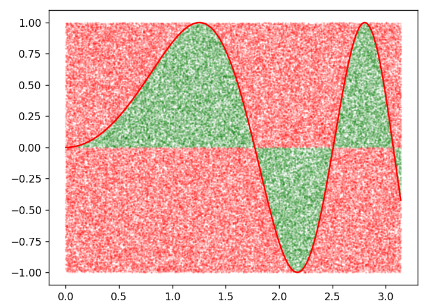

# Monte Carlo

Write a function that, by way of the Monte Carlo method, calculates the integral of any mathematical equation with specified integral boundaries. Take care that both the equation and the generated random points (both the 'correct' and 'incorrect' ones) are displayed on the screen.

## Specification

* Create a new file called `montecarlo.py`.

* Declare a function called `montecarlo()` that can calculate integrals by using a Monte Carlo simulation.

	* The function `montecarlo()` should accept the following five arguments:

		- `func` a function performing an equation of which the integral will be calculated
		- `x1` the minimum x-value surrounding the integral area
		- `y1` the minimum y-value surrounding the integral area
		- `x2` the maximum x-value surrounding the integral area
		- `y2` the maximum y-value surrounding the integral area

		The arguments should be given in the same order as given above, so like this: `montecarlo(func, x1, y1, x2, y2)`

	* The function `montecarlo()` should `return` the area under the graph.

* Declare a function called `plot_montecarlo()` that can plot integrals by using a Monte Carlo simulation.

	* The function should accept the same parameters as `montecarlo()`: `(func, x1, y1, x2, y2)`

	* The function should plot the equation and the points *within* the integral area (the 'correct' points) in green and the points *outside of* the integral area (the 'incorrect' points) in red.

> **Hint:** If you are finding it hard to get started with the `montecarlo()` function, or that function is not giving the correct output, then move on to the `plot_montecarlo()` function first! Plotting random points inside the integral area green and others red is a very useful visual debugging tool. Spotting mistakes in the plotted function will be *a lot* easier than figuring out why an incorrect integral approximation is returned by the computation function.

## Specification

* Create a new file called `montecarlo.py`.

* Declare a function called `plot_montecarlo()` that can calculate integrals by using a Monte Carlo simulation.

	* The function `plot_montecarlo()` should accept the following five arguments:

		- `func` a function performing an equation of which the integral will be calculated
		- `x1` the minimum x-value surrounding the integral area
		- `y1` the minimum y-value surrounding the integral area
		- `x2` the maximum x-value surrounding the integral area
		- `y2` the maximum y-value surrounding the integral area

		The arguments should be given in the same order as given above, so like this: `plot_montecarlo(func, x1, y1, x2, y2)`

	* The function should plot the equation and the points *within* the integral area (the 'correct' points) in green and the points *outside of* the integral area (the 'incorrect' points) in red.

* Declare a function called `montecarlo()` that can calculate integrals by using a Monte Carlo simulation.

	* The function should accept the same parameters as `plot_montecarlo()`: `(func, x1, y1, x2, y2)`

	* The function `montecarlo()` should `return` the area under the graph.

> Note that we listed the plotting function first here. This is by design! Should you have made a mistake in your logic, you can immediately see it in the graph, instead of having to spend a lot of time looking at your code to find the bug.

## Functions as arguments

The Monte Carlo method is another way to approximate an integral, different
from the Riemann sum method covered earlier. Another difference here is that
this approximation method should now be able to integrate **any** equation and
not just quadratic equations. This is done by making the equation that is being
integrated an argument of the integration function.

## Testing

Test your code with the following function:

		def func1(x):
			return sin(x**2)
		print(montecarlo(x, 0, -1, math.pi, 1))
		plot_montecarlo(0, -1, math.pi, 1)

Which should give the following outputs:

		0.77

Test your procedure using the following function, which should be easy to verify:

		def func2(x):
			return 2*x

Also test your program with the following equations. Some can even only be numerically approximated, and have no analytical solution.

$$\int_{0}^{1}x^2 dx$$

$$\int_{0}^{1}x^{x+\frac{1}{2}} ~dx$$

$$\int_{0}^{\pi}sin(x) dx$$

$$\int_{0.2}^{2.2} \tan(\cos(\sin(x))) ~dx$$

$$\int_{0}^{\pi} \sin(x^2) ~dx$$

Add these equations as functions to your own program and make sure to call `montecarlo()` and `plot_montecarlo()` a number of times at the bottom of the file, to verify each of these examples.

## Hints

* First create the graph of the equation so you have a clear view of what area you are integrating.

* Make sure to use red and green points like in the example in the theory section.

* Think carefully about how to deal with parts of the integral area that are situated below the x-axis.

	* When encountering 'negative integral areas', make sure to deduct them from the positive area!

* The size of the rectangle around the integral area should be chosen as tight as possible to maximize efficiency.

* First test your program for an integral of which you know the outcome beforehand. For a few of the example equations that should be the case. Once the program correctly calculates the known integrals, you can try the unknown new integrals.

## Testing

	checkpy montecarlo
