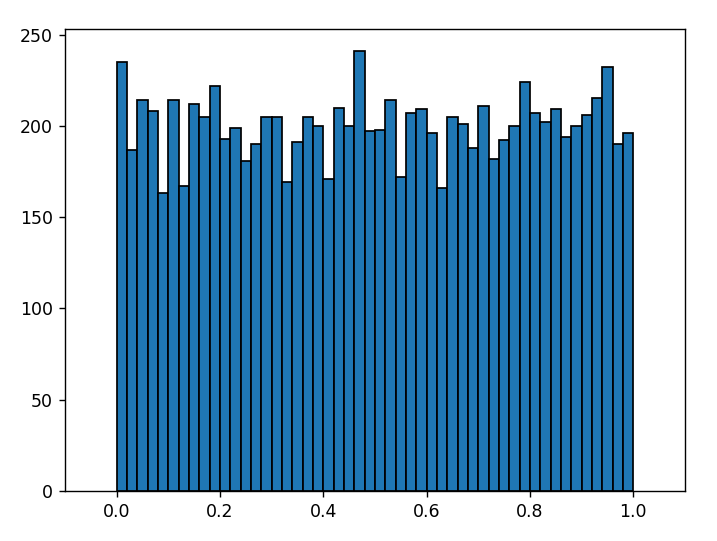

# Histogram

Write a program that visualizes the distribution of numbers from the `random()`-function.

## Background

Plotting a graph of a function, like in the last module, is one of the many ways of visualizing data. This is not always the most obvious strategy, however. When the Volkskrant, for example, makes a graph of how tall the Dutch people are, they use a so-called `histogram` (also known as a bar chart or frequency distribution) in which the data gets grouped together. People, for instance, would be grouped together in percentages of people with lengths ranging from 165-170, 170-175, and so on. This way to represent data also gives some insight in how different groups relate.

## Example: 10.000 random numbers

The idea of generating random numbers is that the random numbers are uniformly distributed between 0 and 1. To get an impression of whether the distribution really is 'flat' we could generate 10.000 random numbers and check each values' frequency.

Below you'll find a small program that generates 10.000 random numbers and stores each random number in a list. When the command `plt.hist()` is given, we specify that we'd like to see the frequency of numbers in ranges of 0.02 (50 bins between the minimum expected value of 0.00 and maximum expected value of 1.00).

    import random
    import matplotlib.pyplot as plt

    # list of random numbers
    random_numbers = []

    # generate 10.000 random numbers
    n = 10000
    for counter in range(n):
        number = random.random()          
        random_numbers.append(number)

    # plot the frequency distribution (50 bins)
    plt.xlim(-0.1, 1.1)
    plt.hist(random_numbers, bins=50, edgecolor='black')
    plt.show()

In Python you can use the option `plt.hist()` to group data before showing it with `plt.show()`. When grouping data together, give some thought to how many bins you want to use to divide your data.

The extra option `xlim` is used to show that no numbers are generated outside of the interval 0.00-1.00. Look up the documentation on the web which options are available to design a histogram that are relevant to you: number of bins, color, axis labels, legend, text and much more.

The result of the code is the histogram displayed below:

## Assignment: distribution of the sum of random numbers

Investigate the distribution of the sum of 100 uniformly generated random numbers.

When we generate a random number uniformly between 0 and 1, its expected value is 0.5. If we take the sum of 100 such numbers in a single trial, the expected sum is 50. However, due to randomness, the sum won't always be precisely 50. This prompts two questions:

* How frequently does the sum fall below 40?
* Is the occurrence of sums greater than 60 as common as those below 40?

### Instructions

Create a file named `histogram.py`.
Inside `histogram.py`, define a function named `sum_random_numbers`.
In the `sum_random_numbers` function:

1. Generate 100 random numbers and calculate their sum. This constitutes one 'experiment'.
2. Repeat the experiment 10,000 times, storing each sum in a list.
After the 10,000 experiments, display the following:
3. A histogram of the sums, with an x-axis range of 30 to 70.
4. Print the percentage of experiments where the sum was less than 40, clearly specifying what this percentage signifies.
5. Print the percentage of experiments where the sum was more than 60, and articulate the significance of this number.
6. Call your function within the file so it executes when `histogram.py` is run.

Constraints: Use the `random` library to generate random numbers and `matplotlib` for visualization.

## Testing

    checkpy histogram
